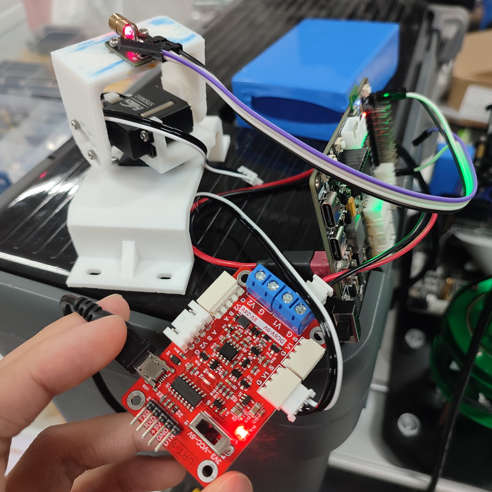
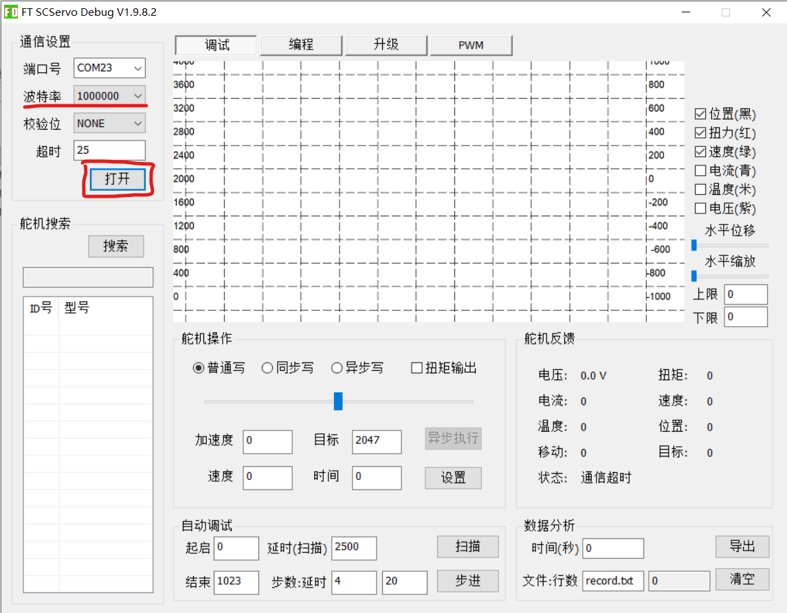
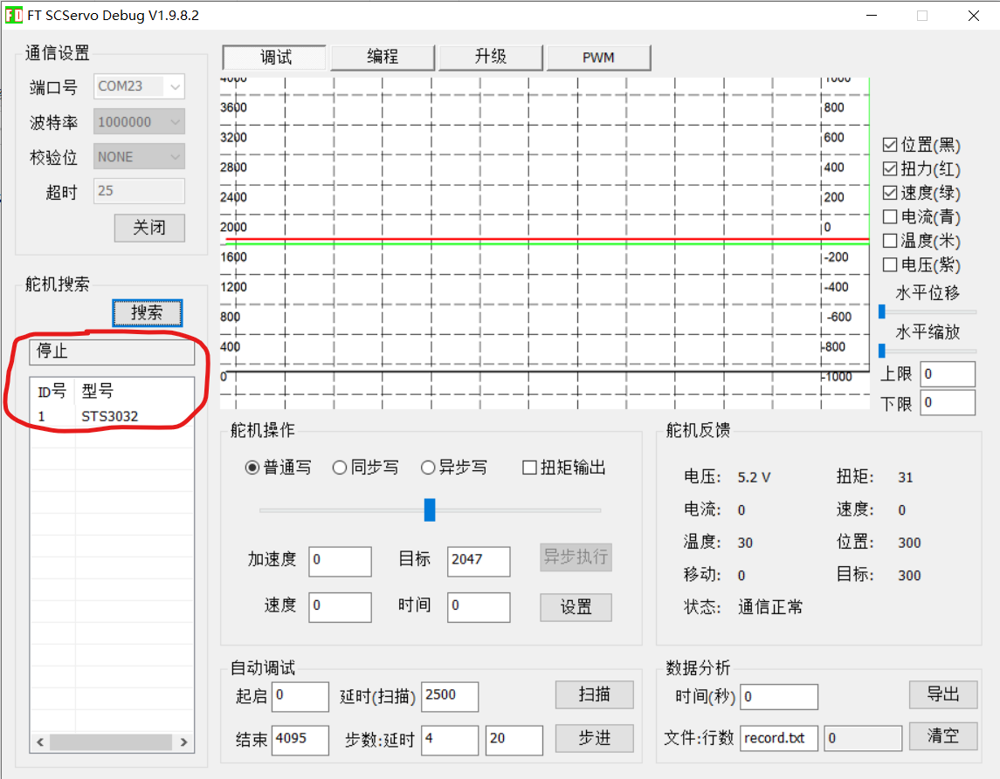
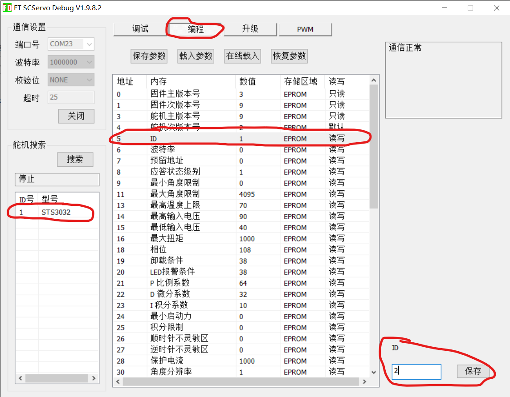

# FeeTech 2D Gimbal

此项目是基于[飞特舵机ST3032](https://item.taobao.com/item.htm?id=625751317567)制作的二维云台的驱动程序。

该项目包含了Linux主机（如Jetson nano）以及Tiva、STM32的驱动程序。

**克隆本项目**

```
git clone https://github.com/Pansamic/FeeTech_2D_Gimbal
```

## :book: 使用说明

### 更改电机ID

需要注意，**初次使用**该电机时，所有的电机的ID都是1，因此对总线发串口信息的时候，两个电机均会对ID为1的指令进行响应，而**不会响应其他ID的指令**。这并不是我们期望的情况。因此，需要将驱动板连接上位机来**更改电机ID**。

将二位云台末端的电机（控制上下的电机）插入驱动板并将驱动板上的microUSB插口连接windows电脑，如下图所示。



打开本项目根目录下的`FD.exe`，如下图。选择波特率为1000000，打开串口。



点击搜索，程序开始搜索驱动板上连接的电机。



首先在左下角框中选择这个电机，然后点击顶上的`编程`栏，选择电机ID，右下角修改ID为2并保存。




### 上电使用

将两个电机都插到驱动板上，如果是linux主机，可以用USB线连接，如果是单片机，可以通过驱动板的排针连接单片机的UART

## :hand: 示例程序

在示例程序中，二维云台会摆头，如果在云台上加上激光笔，可以看到激光笔**画圆**。

### Linux

```shell
git clone https://github.com/Pansamic/FeeTech_2D_Gimbal
cd FeeTech_2D_Gimbal/demo/linux
mkdir build && cd build
cmake ..
make
#'/dev/ttyUSB0'替换成实际连接电机驱动板的串口设备
sudo ./gimbal_demo /dev/ttyUSB0 
```

### STM32

### Tiva

## :rocket: API

### Linux

`void Gimbal_Init(void)`

说明：初始化二维云台。

`void Gimbal_SetAngle(float YawAngle, float PitchAngle)`

### STM32

### Tiva